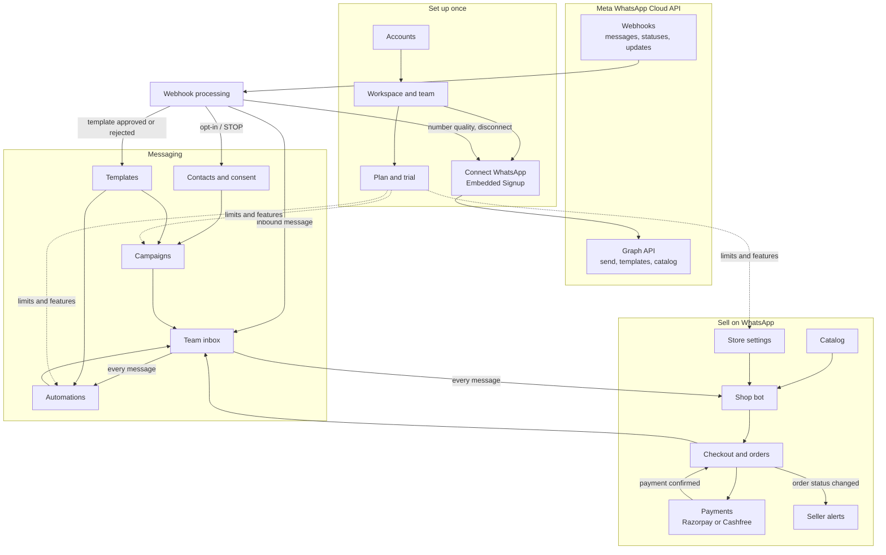
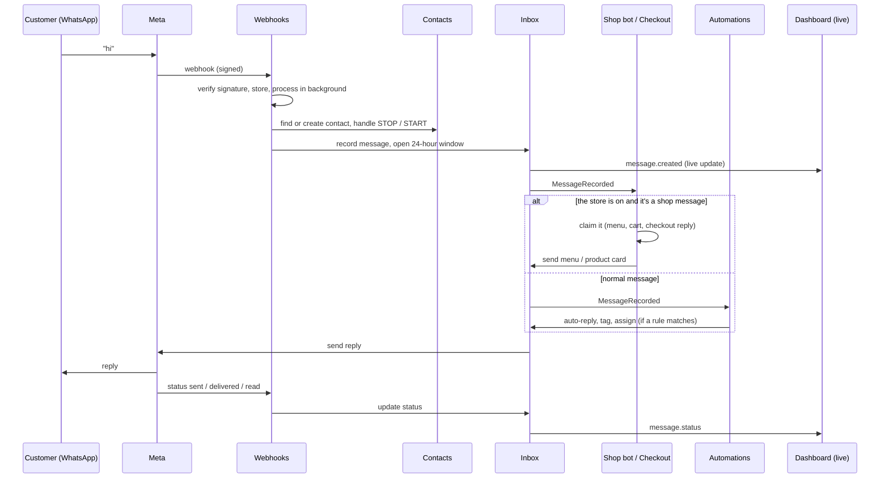
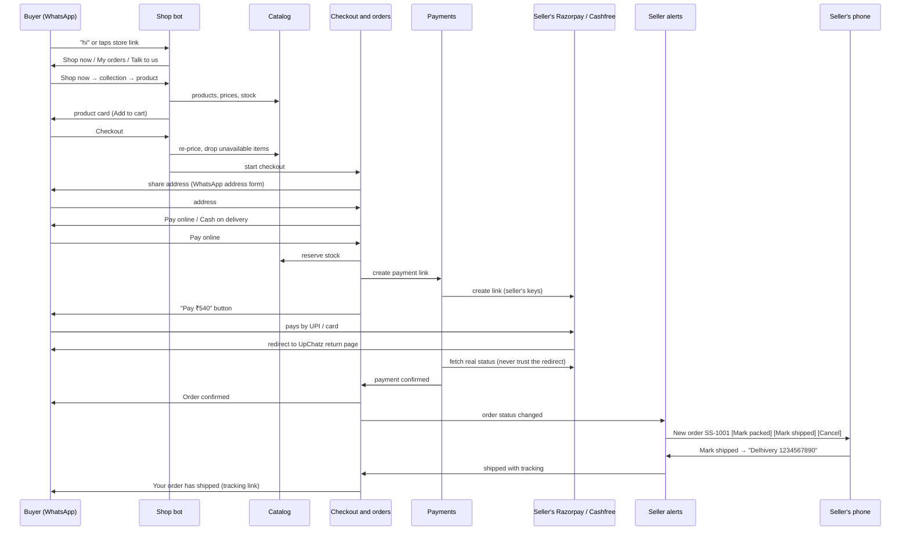

# UpChatz features: what each one does, how they fit together, and why they exist

UpChatz ([upchatz.com](https://upchatz.com)) lets Indian businesses run customer messaging and sales on WhatsApp through the **official WhatsApp Business Platform (Cloud API)**. A business connects its own number in a few clicks (Meta Embedded Signup). Then it can:
- chat with customers from a shared team inbox;
- send approved broadcasts;
- automate replies;
- from wave 3, sell products inside WhatsApp.

This document explains the product, not the code. For API details see `docs/contracts/wave-2.md` and `docs/contracts/wave-3-commerce.md`.

**Status legend:**

| Label | Meaning |
|---|---|
| **Live** | Merged and deployed (waves 0–2) |
| **Built** | Wave 3 "Sell on WhatsApp": merged and tested, not live on upchatz.com yet |
| **Planned** | Agreed direction, not started |

---

## 1. Feature map

| # | Feature | What it does | Why it's needed | Status |
|---|---|---|---|---|
| 1 | Accounts and login | Sign up, log in, stay logged in, change password | Every action belongs to a real person | Live |
| 2 | Workspaces, team and roles | One workspace per business, invite teammates, roles owner / admin / agent / viewer | Several staff share one WhatsApp number safely; each business's data is kept apart | Live |
| 3 | Plans, trial and billing | 14-day trial, Starter / Growth / Pro plans, Razorpay subscription, GST invoices, usage limits | How UpChatz earns money; limits protect the service | Live |
| 4 | WhatsApp connection | Embedded Signup, phone number registration, quality and status tracking, disconnect | Nothing can be sent until a number is connected the official way | Live |
| 5 | Meta webhooks | Receives every message, delivery status and account update from Meta | Meta tells us what happened; every other feature reacts to it | Live |
| 6 | Contacts and consent | Contact list, tags, CSV import, opt-in / opt-out (STOP) | Meta requires recorded opt-in for marketing; tags pick audiences | Live |
| 7 | Message templates | Create, submit to Meta for approval, sync status, preview | Meta allows business-initiated messages only with approved templates | Live |
| 8 | Team inbox | Two-way chat, media, notes, assignment, read receipts, live updates | Where the business actually talks to customers | Live |
| 9 | Campaigns | Broadcast a template to a tagged audience, now or scheduled, with stats and cost estimate | Promotions, reminders, announcements at scale | Live |
| 10 | Automations | Rules: keyword, first message, new contact or outside business hours → send, tag, assign, close | Instant replies without staff; routing | Live |
| 11 | Dashboard home | Overview cards and setup progress | Shows what needs attention first | Live, commerce cards Built |
| 12 | Store settings | Turn the store on, shop mode, shipping, COD rules, pincodes, bot text, setup checklist, store link | One place to configure selling | Built |
| 13 | Catalog | Products, collections, images, CSV import, optional sync to Meta's native catalog | What buyers browse and buy | Built |
| 14 | Shop bot | Menu → collections → product cards → cart in chat; also accepts WhatsApp native carts | Lets buyers shop inside WhatsApp without a website | Built |
| 15 | Checkout and orders | Address, payment choice, stock reservation, order status, buyer updates, "My orders" | Turns a cart into a trackable order | Built |
| 16 | Payments | Seller connects their own Razorpay or Cashfree keys; UpChatz creates payment links and confirms payment | Buyers pay online; money goes straight to the seller | Built |
| 17 | Seller alerts | New-order alerts on the seller's personal WhatsApp with *Mark packed / shipped / Cancel* buttons | Small sellers live on their phone, not in a dashboard | Built |
| 18 | Marketing site | Landing page, pricing, FAQ, "Sell on WhatsApp" section | Explains the product and brings sign-ups | Live, commerce section Built |
| 19 | Analytics | Reports on messages, campaigns and sales | Sellers need to see what works | Planned |
| 20 | Developer API | API keys and outbound webhooks for the business's own systems | Integrations with existing software | Planned |
| 21 | Message credit wallet | UpChatz collects message charges and pays Meta | Removes the "add a card in WhatsApp Manager" step | Planned (needs Meta Solution Partner status) |

---

## 2. How everything fits together

### 2.1 The big picture

Three ideas hold the product together:

1. **Everything is inside a workspace.** Every contact, message, product and order belongs to one workspace. Team roles decide who can see or change it. That keeps businesses separate and lets a team share one number.
2. **Meta is the source of truth for WhatsApp.** We send through the Graph API, and Meta reports back through webhooks: a message arrived, it was delivered, a template got approved, the number's quality changed. The webhook app checks Meta's signature and stores each delivery. It then turns the delivery into internal events, which other features react to. Meta can deliver the same event twice, so every reaction is safe to repeat.
3. **All sending goes through one path.** Inbox replies, campaigns, automations, the shop bot and order updates all use the same send function. It applies Meta's rules in one place:
   - Is the number connected?
   - Is the 24-hour window open?
   - Is the template approved?
   - Has the contact opted out?

   No feature can accidentally break a rule another feature respects.

### 2.2 What happens when a customer sends a message

Shop messages (menu buttons, carts, addresses, payment choices) are **claimed** by the store, so automations don't also answer them. Other text still reaches automations and the inbox, so staff always see the full conversation.

---

## 3. Features in detail

### 3.1 Accounts and login (Live)
- **What:** register with email and password, log in, refresh the session, log out, change password, view profile.
- **How:** JWT access tokens are kept in memory in the browser, with a refresh token that survives reloads. Logging out blacklists the refresh token. Several browser tabs share one refresh, so they don't log each other out.
- **Why:** every change in the product is tied to a person, for security and so the inbox can show "sent by".
- **Connects with:** workspaces (a user can belong to several), inbox (`sent_by`), orders (who changed a status).

### 3.2 Workspaces, team and roles (Live)
- **What:** create a workspace (business name, time zone), invite teammates by email, change roles, remove members, leave.
- **Roles:**
  - **owner:** billing, deleting accounts.
  - **admin:** settings, campaigns, templates, store.
  - **agent:** chats and order handling.
  - **viewer:** read only.
- **How:** every request names its workspace. People who aren't members get "not found", so they can't even tell a workspace exists. A role change or removal immediately disconnects that person's live dashboard.
- **Why:** a shop owner and two staff can share one WhatsApp number without sharing a password, and each business's data stays private.
- **Connects with:**
  - billing (member limits per plan);
  - the time zone (business hours, scheduled campaigns, "orders today").

### 3.3 Plans, trial and billing (Live)
- **What:**
  - A 14-day Growth trial starts automatically when a workspace is created.
  - Plans: Starter, Growth and Pro, monthly or annual (annual costs 10 months). Prices live in `frontend/src/config/site.ts` and exclude GST.
  - Razorpay subscription checkout, cancellation, a billing profile with GSTIN, and GST invoices (CGST + SGST, or IGST).
- **Limits per plan:** WhatsApp numbers, team members and contacts.
- **Features per plan:**
  - scheduled campaigns, keyword automations and API access are on Growth and Pro;
  - the store (`commerce`) is on every plan for now.
- **How:** other features ask one module (`entitlements`) "may this workspace do X?". If a subscription is halted, cancelled or expired, existing data stays but nothing new can be added.
- **Why:** it's how UpChatz is paid. Limits keep costs predictable, and feature gates make higher plans worth buying.
- **Note:** this is UpChatz's subscription fee. WhatsApp message charges and buyer payments are separate (see section 4).

### 3.4 WhatsApp connection (Live)
- **What:** a "Connect WhatsApp" button opens Meta's Embedded Signup. The business logs in with Facebook, picks or creates its WhatsApp Business Account (WABA) and verifies its number.
- **How:**
  1. The WABA is created in the **business's own Meta portfolio** and shared with UpChatz's app (UpChatz is a Meta Tech Provider).
  2. We store the access token encrypted, register the phone number with a PIN and subscribe to its webhooks.
  3. Every day we refresh the number's status, quality rating and messaging limit.
  4. If Meta reports the business removed us, or the account was restricted, we mark it and tell the user to reconnect.
- **Why:** it's the only official, ban-safe way to use WhatsApp for business. The business keeps ownership of its number and its Meta relationship. Unofficial WhatsApp Web tools are deliberately not supported.
- **Connects with:**
  - everything that sends;
  - billing (number limit);
  - catalog (native catalog needs extra Meta permissions granted at signup).

### 3.5 Meta webhooks (Live)
- **What:** one public endpoint receives everything Meta reports: inbound messages, delivery and read statuses, template approvals, number quality and account events.
- **How:**
  1. The endpoint checks Meta's signature and stores the raw delivery, so nothing is lost if a later step fails.
  2. A background job parses the delivery, finds which workspace owns the number and emits internal events.
  3. Failed jobs retry up to 5 times, stuck deliveries are re-queued every 10 minutes, and old deliveries are purged daily.
  4. Messages sent to UpChatz's own **alerts number** go to seller alerts instead of any workspace.
- **Why:** WhatsApp is asynchronous. We only find out a message was delivered, read, or replied to when Meta tells us.
- **Connects with:**
  - inbox (messages and statuses);
  - contacts (opt-in/out, Meta's marketing opt-out error);
  - templates (approval status);
  - WhatsApp connection (quality, disconnect);
  - seller alerts (platform number).

### 3.6 Contacts and consent (Live)
- **What:** a contact list with name, phone, email, custom attributes and tags. You can add contacts by hand, import them from CSV, or get them created automatically when someone messages you.
- **Consent:** each contact has a marketing opt-in status (unknown / opted in / opted out) with a history of changes. A customer sending STOP opts out and START opts back in. If Meta reports that the user blocked marketing, that is recorded too.
- **Why:**
  - Meta requires recorded opt-in before sending marketing, and ignoring STOP damages the number's quality rating and can get it restricted.
  - Tags are how campaigns choose an audience and how automations organise people.
- **Connects with:**
  - campaigns (audience, consent check at send time);
  - inbox (conversation per contact);
  - automations (add tags);
  - billing (contact limit);
  - orders (buyer name and phone, saved address).

### 3.7 Message templates (Live)
- **What:**
  - create template drafts: header, body with variables, footer, buttons;
  - submit them to Meta;
  - see the approval status, rejection reason, quality and category;
  - preview them with sample values;
  - delete them.
- **How:**
  1. Templates are submitted to the business's WABA through the Graph API.
  2. Meta's webhook updates the status, and an hourly sync catches anything missed.
  3. When sending, variables are filled in from contact fields, attributes or fixed text.
- **Why:** outside the 24-hour customer service window, Meta only allows **approved templates**. Campaigns, reminders and "your order shipped" messages sent days later all depend on them.
- **Connects with:**
  - campaigns (the template to broadcast);
  - automations (send template action);
  - orders (status update templates, with a "create starter templates" button);
  - seller alerts (UpChatz's own platform templates).

### 3.8 Team inbox (Live)
- **What:**
  - conversation list with filters (open / pending / closed, assigned to me, unassigned, unread, search);
  - chat view with text, media and template sending;
  - internal notes, assignment, close / reopen, read receipts;
  - a live indicator showing whether the 24-hour window is open.
- **How:**
  - Each inbound message opens or extends the 24-hour window for that contact and number.
  - Outbound messages are queued and sent in the background, then updated as Meta reports sent / delivered / read.
  - Wave 3 adds rendering of shop messages: product cards, carts, payment links.
  - A secure WebSocket pushes new messages and status changes to every open dashboard. It's joined with a single-use ticket, and access is re-checked on connect.
- **Why:** it's the core daily tool. Customers message the business, and staff need one shared place to answer quickly and see history.
- **Connects with:** every sending feature. Campaign replies, automation replies, shop bot messages and order updates all appear in the same conversation, so staff see the full story.

### 3.9 Campaigns (Live)
- **What:** pick an approved template, an audience (tags, match any/all, or specific contacts), fill in variables from contact data, and get:
  - an audience preview (eligible vs skipped for opt-out or no opt-in);
  - a cost estimate;
  - a consent confirmation before launch.

  Then launch now or schedule, pause / resume / cancel, and watch live stats (sent, delivered, read, failed, replied).
- **How:**
  1. At launch the audience is frozen into recipients.
  2. Messages go out in the background within Meta's rate and tier limits.
  3. Consent is re-checked just before each send.
  4. Delivery webhooks update each recipient and the stats.
- **Why:** broadcasts (festival offers, restock news, payment reminders) are one of the main reasons businesses buy WhatsApp tools. The consent checks protect the number from being flagged.
- **Connects with:**
  - templates and contacts (inputs);
  - inbox (sends through it, replies land in it);
  - billing (scheduling is a plan feature).

### 3.10 Automations (Live)
- **What:** rules with a trigger and up to 5 actions.
  - **Triggers:** keyword (exact / contains), first message ever, new contact, message outside business hours.
  - **Actions:** send text, send template, add tags, assign to a teammate, close the conversation. Wave 3 adds *send shop menu*, *send catalog* and *send collection*.
  - **Options:** cooldown, priority, "stop processing further rules", per-number rules, business hours per weekday, and a run log showing what fired and why something was skipped.
- **How:** every inbound message is checked against active rules in priority order. Each action runs once per message, even if Meta delivers the webhook twice. Shop messages claimed by the store are skipped.
- **Why:** customers expect instant answers (prices, timings, "hi"), and small teams can't watch the inbox all day.
- **Connects with:**
  - inbox (input messages, output replies);
  - templates, contacts (tags) and team (assign);
  - the shop bot (shop actions);
  - billing (keyword automations are a plan feature).

### 3.11 Dashboard home (Live, commerce cards Built)
- **What:** overview cards. Wave 3 adds **Orders today** (count, revenue, open, needs attention, awaiting payment) and **Store setup** progress.
- **Why:** the first screen should tell the owner what needs attention now.

---

### Sell on WhatsApp (wave 3, Built)

The goal: a buyer can **browse, order, pay and track without leaving WhatsApp**, and a seller can **run the shop mostly from their phone**. It's built on everything above:
- the connected number;
- the webhooks;
- the one sending path;
- templates for updates;
- contacts for buyers;
- the inbox for conversations.

### 3.12 Store settings (Built)
- **What:**
  - Store on/off.
  - Shop mode: **bot** (works for everyone) or **native catalog** (WhatsApp's own catalog and cart).
  - Store name, welcome message and menu keywords.
  - Order number prefix (e.g. `SS-1001`).
  - Minimum order, shipping fee and free-shipping threshold.
  - Cash on delivery on/off, COD fee and COD maximum.
  - Serviceable pincodes, support message, and a "Powered by UpChatz" footer.
  - Which template to use for each order update.
- **Setup checklist:** connect WhatsApp → add products → payments (gateway or COD) → order update templates → alert number → turn store on. Then share the store link (`wa.me/<number>?text=Hi`).
- **Why:** sellers must be able to go from sign-up to taking orders in minutes, and the checklist shows exactly what's missing. The "Powered by UpChatz" footer brings new sellers from buyers who see it.
- **Connects with:**
  - catalog (needs active products);
  - payments;
  - templates;
  - seller alerts;
  - billing (store is a plan feature).

### 3.13 Catalog (Built)
- **What:**
  - **Products:** SKU, name, description, price and sale price, image, stock (or not tracked), max per order, active.
  - **Collections:** with ordering.
  - **Import and images:** CSV import; image upload (JPEG/PNG, at least 500×500).
  - **Native catalog:** optional connection to a Meta catalog, or creating one, with product sync and Meta review status (approved / rejected with reasons).
- **How:**
  - Prices are stored in paise and are GST-inclusive.
  - Stock is reserved atomically, so two buyers can't buy the last item.
  - Product changes sync to Meta in batches, respecting Meta's rate limits.
- **Why:** buyers need something to browse, and checkout must always use the seller's real price and stock, never what a message claims.
- **Two modes, why both:**
  - **Bot mode** works on day one for every seller.
  - **Native catalog** looks better, but needs Meta approval of extra permissions, Commerce Policy compliance and a review of each product. It becomes an upgrade, not a blocker.

### 3.14 Shop bot (Built)
- **What:**
  - welcome menu;
  - collection list;
  - product lists with paging ("More products");
  - product cards with image, price and *Add to cart / Change qty / Back*;
  - cart view, checkout, "My orders", "Talk to us".

  It also accepts carts sent from WhatsApp's native catalog, and shop actions can be triggered from automations.
- **How:**
  - The cart is kept on the server per conversation and expires 24 hours after the buyer's last message.
  - Every button carries an id checked against the current state, so an old button (deleted product, old page) gets a polite "no longer available" instead of a wrong action.
  - Replies happen inside the buyer's open 24-hour window, so no templates are needed.
- **Why:** most Indian small sellers don't have a website, and buyers already live on WhatsApp.
- **Connects with:** catalog (what to show), store settings (texts, mode), checkout (hand-off), automations (shop actions), inbox (all messages visible to staff).

### 3.15 Checkout and orders (Built)
- **Checkout steps:**
  1. **Re-price** from the catalog. Unavailable items are dropped and explained. If WhatsApp showed a different total, the buyer confirms the new one.
  2. **Address:** WhatsApp's address form for Indian numbers, pre-filled from the last order, with a pincode check. A text fallback covers older WhatsApp apps.
  3. **Payment choice:** online (only if the gateway is verified) or COD (only if enabled and under the limit).
  4. **Stock** is reserved when payment is chosen.
  5. **Online:** a payment link is sent. **COD:** the order is confirmed immediately.
- **Order statuses:** checkout stages → pending payment → **confirmed → packed → shipped → delivered**, or cancelled / expired / **needs attention**.
  - Needs attention covers a buyer who paid after checkout expired and stock ran out. The seller decides to fulfil it or refund.
- **Seller actions** (dashboard or WhatsApp): pack, ship (courier, AWB, tracking link), deliver, cancel (restock, cancel the open payment link), mark COD collected, mark refunded, notes.
- **Buyer updates:**
  - inside the 24-hour window, a normal WhatsApp message;
  - outside it, the seller's approved update template;
  - if no template is mapped, the timeline shows the update wasn't sent.
- **Safety rules:**
  - one active checkout per buyer (a new cart replaces the old one);
  - abandoned checkouts expire after about 35 minutes and release stock;
  - duplicate webhooks and double taps do nothing;
  - money is always integer paise.
- **Why:** this turns chat into real, trackable business: no lost orders, no overselling, and buyers are kept informed.
- **Connects with:**
  - catalog (price, stock);
  - payments;
  - contacts (buyer, saved address);
  - templates (updates);
  - seller alerts;
  - inbox (conversation link);
  - dashboard home and the orders screen (live).

### 3.16 Payments (Built)
- **What:** the seller connects **their own Razorpay or Cashfree account**:
  1. choose the gateway (and test/live for Cashfree);
  2. paste the key id and secret;
  3. press Verify.

  **No webhook setup is needed.**
- **How:**
  - For each online order, UpChatz creates a payment link on the seller's account. It expires in 30 minutes, and the gateway's own SMS/email are off because we message the buyer on WhatsApp.
  - After paying, the buyer lands on an UpChatz return page. It asks the gateway for the real status and never trusts the redirect alone, then shows "Payment received, go back to WhatsApp".
  - A background job also checks open links at 2, 4, 6, 10, 15, 20, 25 and 30 minutes, in case the buyer closes the browser.
  - A payment counts only when the amount and currency match, and each payment confirms an order exactly once.
  - An optional webhook can make confirmation faster.
  - Keys are stored encrypted and never shown again.
- **Why these choices:**
  - **Seller's own gateway:** the money goes straight to the seller. UpChatz never holds buyer money, so no payment licences, settlements or refund liability.
  - **Razorpay and Cashfree:** the two gateways most Indian small sellers already have.
  - **No webhook step:** "paste two keys" is something any seller can do.
  - **Never manual UPI confirmation:** it's slow and error-prone for sellers and easy to fake.
  - **COD always possible:** many Indian buyers prefer it, and it lets sellers start before a gateway is set up.
- **Connects with:** checkout (create and cancel links), orders (payment confirmed / expired), store checklist, and the return page's link back to the store's WhatsApp.

### 3.17 Seller alerts (Built)
- **What:**
  - The seller adds up to 3 personal WhatsApp numbers and confirms each from a verification message.
  - Alerts: new order (items, total, paid/COD), needs attention, and a confirmed order cancelled by the buyer or UpChatz. Carts abandoned or replaced during checkout never alert. New-order alerts come with *Mark packed / Mark shipped / Cancel* buttons; *Cancel* asks *Yes, cancel / Keep order* first, so one mis-tap can't lose a sale.
  - **Commands:**
    - `ORDERS`: today's open orders.
    - `HELP`: the command list.
    - `STOP`: stop alerts.
    - After *Mark shipped*: reply with `courier AWB [tracking link]`.
- **How:**
  - Alerts come from **UpChatz's own alerts number**, not the seller's store number: that number is now in the Cloud API and can't be used in the seller's normal WhatsApp app.
  - Commands only work from verified numbers, and every action is checked to belong to that seller's workspace.
  - While the seller has messaged the alerts number in the last 24 hours, alerts are sent as free-form messages. Templates are used only outside that window.
- **Why:** small sellers run their business from their phone. They should hear about an order instantly and ship it without opening a laptop.
- **Connects with:** orders (status change → alert; button → status change), webhooks (platform number routing), templates (platform templates).

### 3.18 Marketing site (Live, commerce section Built)
- **What:** landing page with product, how it works, official vs unofficial WhatsApp, messaging rules, security, use cases, pricing, developers and FAQ. Wave 3 adds a "Sell on WhatsApp" section.
- **Why:** explains the product honestly and brings sign-ups. Meta claims stay hedged ("under Meta's current pricing").

### 3.19 Planned
- **Analytics:** message, campaign, automation and sales reports.
- **Developer API:** API keys and outbound webhooks. The API access plan feature already exists.
- **Message credit wallet:** sellers top up with UpChatz and UpChatz pays Meta. This needs Meta **Solution Partner** status (credit line sharing) or a partnership with an existing Solution Partner; as a Tech Provider we can't pay for a seller's WABA.
- **Later commerce:**
  - Shiprocket and other couriers;
  - Shopify / WooCommerce sync;
  - coupons, product variants and abandoned-cart reminders;
  - more payment gateways.

---

## 4. Who pays for what

| Cost | Who pays | Paid to | Notes |
|---|---|---|---|
| UpChatz subscription | Business | UpChatz (Razorpay subscription) | 14-day trial first |
| WhatsApp message charges on the business's number | Business | Meta directly | Meta bills the business's own WABA. They add a payment method in WhatsApp Manager during signup or later. Under Meta's current pricing, replies inside the 24-hour window are free; business-initiated templates outside it are charged. Without a payment method, paid messages fail but free replies still work. |
| Buyer's order payment | Buyer | Seller's own Razorpay / Cashfree | UpChatz never holds it. Gateway fees are between the seller and their gateway. |
| Seller alert messages | UpChatz | Meta | From UpChatz's alerts number; kept low by using free-form messages inside the window |
| Refunds | Seller | Buyer, via the seller's gateway dashboard | Marked as refunded in UpChatz |

---

## 5. Meta rules that shape the product

| Rule | Where the product handles it |
|---|---|
| Business-initiated messages need **approved templates** outside the 24-hour customer service window | Templates; the send path checks the window; order updates switch to templates outside it |
| Marketing needs **recorded opt-in**, and STOP must be honoured | Contacts consent; campaigns skip and re-check; automations and sends block opted-out contacts |
| Sending is capped by **messaging limit tiers** and the **number quality rating** | Daily number refresh; campaigns throttle; consent checks protect quality |
| Interactive messages have limits (3 buttons, 10 list rows, title lengths) | The shop bot builds within them and pages long lists |
| Native catalog needs Meta app review of `catalog_management` and `business_management`, the Commerce Policy and product review | Bot mode works without it; the catalog shows review status and reasons |
| Only official Cloud API access | Embedded Signup only; no WhatsApp Web automation |

---

## 6. What the owner must set up outside the code

- **Meta app:**
  - Embedded Signup configuration, webhook subscription and Tech Provider status.
  - For native catalog: App Review for `catalog_management` and `business_management`, added to the signup configuration; existing sellers reconnect.
- **Alerts number:** UpChatz's own WABA and phone number, a system user token, and the platform templates (`upc_seller_verify`, `upc_new_order`, `upc_order_attention`) approved via `manage.py sync_platform_templates`.
- **Hosting:** a public HTTPS bucket or CDN for product images, because Meta must be able to fetch them.
- **Razorpay (UpChatz's own):** subscription plans and a webhook for UpChatz billing.
- **Each seller:** their own Razorpay or Cashfree account (KYC done) and a payment method on their WABA in WhatsApp Manager.
